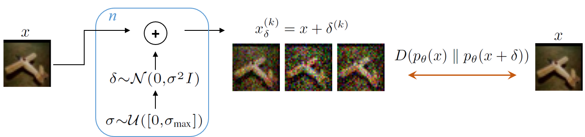

# Diverse Gaussian Noise Consistency Regularization for Robustness and Uncertainty Calibration under Noise Domain Shifts

Preprint: https://arxiv.org/abs/2104.01231

## Method Description

During training, input images x are fed into n independent branches each associated with a new augmented sample. Each branch adds Gaussian noise to clean images controlled by a variety of scales sampled from a uniform distribution, and a consistency loss with respect to the clean images is formed. Our DiGN training procedure trains a network with this type of diverse consistency regularization.

## Directories
- models: contains saved model checkpoints
- results: contains .pkl files generated from testing
- CIFAR-10-C: .npy files for each corruption
- CIFAR-100-C: .npy files for each corruption
- Tiny-ImageNet-C: folders for each corruption
  - 'brightness'
   - 1: severity 1
    - class1

## Training
To train CIFAR-10 ResNet-18 model using Standard training, batch size 512:

```
python train.py cifar10 resnet18 512 standard
```

To train CIFAR-10 ResNet-18 model using DiGN training, batch size 512:

```
python train.py cifar10 resnet18 512 dign_gn
```

Other baselines are available in 'train.py', including:
- AT
- TRADES
- RSE
- DeepAugment
- AugMix
- DiGN w.o. CR


## Robustness Evaluation
To evaluate robustness under corruptions for a CIFAR-10 ResNet-18 model:

```
python test-rob-c.py cifar10 resnet18 512 [Boolean_test_time_ensemble] [model_name] [Boolean_noise_only_eval]
```

To evaluate a model only on digital noise corruptions (mCA-N), assuming the model in 'models' directory saved as 'RN18_cifar10_DIGN_model_X', use:

```
python test-rob-c.py cifar10 resnet18 512 False DIGN_model_X True
```

and for evaluating on all common corruptions (mCA), use instead:

```
python test-rob-c.py cifar10 resnet18 512 False DIGN_model_X False
```

## Uncertainty Calibration Evaluation
To evaluate uncertainty calibration under corruptions for a CIFAR-10 ResNet-18 model:

```
python test-cal-c.py cifar10 resnet18 512 [Boolean_test_time_ensemble] [model_name] [Boolean_noise_only_eval]
```

To evaluate a model only on digital noise corruptions (RMSE-N), assuming the model in 'models' directory saved as 'RN18_cifar10_DIGN_model_X', use:

```
python test-cal-c.py cifar10 resnet18 512 False DIGN_model_X True
```

and for evaluating on all common corruptions (RMSE), use instead:

```
python test-cal-c.py cifar10 resnet18 512 False DIGN_model_X False
```
